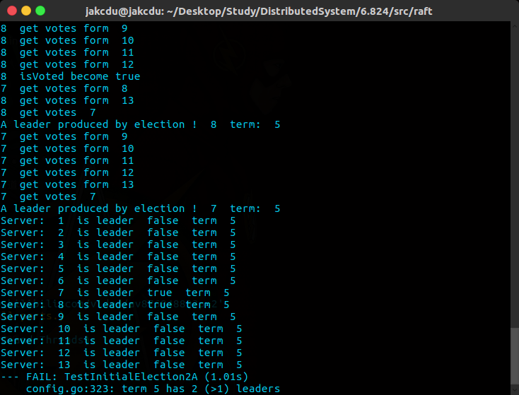

#### LAB 2A

注意的地方

1. 由于试用了rpc通信，所以在定义需要被序列化，通过rpc通信的数据结构时，首字母大写

2. 在选举和发送心跳包的时候应该使用协程去做并发，而不应该使用for循环，一时for循环一个一个通信效率低，二是for循环中如果出现阻塞会导致超时的bug，而且这部分也不好解决（我目前没想到），所以使用协程做并发式的通信效率更高，而且代码逻辑更简单，且能避免rpc阻塞引发的超时bug
3. 并发控制，之前的代码只是

4.  心跳时间和rand时间的设定。

