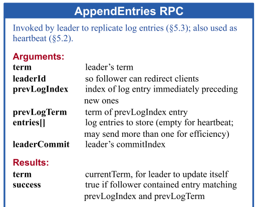
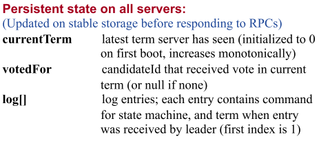
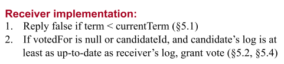

#### LAB 2B

Lab2B做的是raft的log的replication部分，所以这部分主要是对rf.log进行复制并且保证各个节点上的咯个的一致。在论文中主要是根据preLogIndex和nextIndex来复制log。其中nextIndex表示下一条需要复制到Follower节点的log的index。初化为len(rf.log)，超出log的范围指向空表示无需向Follower发送log。而preLogIndex表示上一条已经复制的log的index，初始化为nextIndex - 1指向当前最新的log。

因为preLogIndex初始化为nextIndex - 1 = len(rf.log) - 1。按照论文的说法这边建议在初始化rf.log 为    rf.log = make([]LogEntry,1)，并且插入的第一个log的index为1。这样做的好处是，减少了对preLogindex为-1的处理，在实现的时候代码的逻辑更简单（论文真的要多看，仔细看！少踩很多坑）。

因为Lab2B中过程需要写入log，所以在选举过程中不能只比较任期的大小，还要根据候选人Log的index和Term来决定是否投票。这就不能和Lab2A中那样，只需要把票投给任期比当前任期更大的候选人。

~~~go
	if args.Term > rf.currentTerm {
		if rf.state != Follower {
			rf.becomeFollower(args.Term)
		}
		rf.currentTerm = args.Term
		rf.isVoted = true
		reply.VoteGranted = true
	}		
~~~

参见论文$5.1， 5.2， 5.4，如果候选人任期比当前任期更小直接拒绝投票请求。否则根据候选人Log是否为最新来决定是否投票。如果按照Lab2A中的实现方式会导致同一轮选举中log不是最新的候选人获得选票，所以应该添加一些比较log的判断语句。并且只有在收到更大的任期号的时候（意味着新的一轮选举开始），必须要先判断和刷新isVoted的值，以防止一票多投或者不投。

~~~go
	if args.Term > rf.currentTerm {
		rf.becomeFollower(args.Term)
	} 
	if args.LastLogTerm < rf.getLastLogTerm(){
		return 
	}
	if args.LastLogTerm == rf.getLastLogTerm() && 
							args.LastLogIndex < rf.getLastLogIndex(){
		return
	}
~~~

在测试的时候发现一直报错，

one(100) failed to reach agreement，出现这原因是因为第一个测试点检测的是各个server的applied Command是否一样。因为applied command 是通过applyCh来传递消息，并且在Make函数中传递 了applyCh的，所以自己使用make(chan ApplyMsg,1)给applyCh赋值使得applied Message无法发送到测试程序。

1. 应该直接用函数中的applyCh直接赋值而不是make(chan ApplyMsg,1)

~~~go
func Make(peers []*labrpc.ClientEnd, me int,
	persister *Persister, applyCh chan ApplyMsg) *Raft {
    rf.applyCh = applyCh
}
~~~

2. updateLastApplied() 函数将commit command 发送到状态机中

~~~go
func (rf *Raft) updateLastApplied(){
 	for rf.lastAplied < rf.commitIndex{
		rf.lastAplied++
		applyMsg := ApplyMsg{
			true,
			rf.log[rf.lastAplied].Command,
			rf.lastAplied,
		}
		rf.applyCh <- applyMsg
	}
}
~~~

每次添加了新的log以后就应该检查和更新commit log，使得新添加的log被应用到状态机器中。根据论文可知，当节点中的一半以上的节点成功的复制了某条log以后，leader就可以将其commit并且提交到状态机中。但是这样一条一条的检测非常麻烦且难以实现。我们可以直接利用matchIndex来获取各个节点同步完成的最大index。并且所有节点（2N+1）的matchIndex中值（保证至少N+1个节点上该index位置的log已同步完成）就是一半以上节点已经replicate完成的最大的index。除此之外，为了防止出现论文图8的情况，Leader不能提交非当前任期的log，只能等有当前任期的的log被提交才能将之前任期未提交的log一并提交。所以在提交之前需要判断rf.log[N].Term == rf.currentTerm。

~~~go
func (rf *Raft) updateCommitIndex(){
	rf.matchIndex[rf.me] = len(rf.log) - 1
	copyMatchIndex := make([]int,len(rf.matchIndex))
	copy(copyMatchIndex, rf.matchIndex)
	sort.Ints(copyMatchIndex)
	N := copyMatchIndex[len(copyMatchIndex) / 2]
	if N > rf.commitIndex && rf.log[N].Term == rf.currentTerm{
		rf.commitIndex = N	
		rf.updateLastApplied()
	}
}
~~~

节点log的对齐和复制

在Lab2A中我们只需使用AppendEntry函数发送心跳包所以实现的非常简单。因为在Lab2B中需要使用AppendEntry函数复制和同步log。所以需要通过PrevLogIndex和PrevLogTerm来判断log复制的初始位置。由论文可知，相同位置的log的term如果相同那么则可以认为两条log相同。因为Follower节点的log的大小可能会比Leader的初始PrevLogIndex小，所以当args.PrevLogIndex < len(rf.log)和prevLogTerm != args.PrevLogTerm时直接返回reply.Success = false。否则匹配成功将args.Entries添加到当前的log上。但是由于可能存在log冲突的问题，根据论文可以直接将冲突log覆盖掉。完成log的复制以后更新commit log并且将起应用到状态机中。 在AppendEntry中

~~~go
	reply.Success = false
	prevLogTerm := -1
	if args.PrevLogIndex >= 0 && args.PrevLogIndex < len(rf.log){
		prevLogTerm = rf.log[args.PrevLogIndex].Term
	}
	if prevLogTerm != args.PrevLogTerm {
		return
	}
	
	// Append entry to Follower's log 
	index := args.PrevLogIndex 
	for i := 0; i < len(args.Entries); i++ {
		index++
		if(index >= len(rf.log)){
			rf.log = append(rf.log,args.Entries[i:]...)
            reply.Success = true
			break
		}
        // Find the begin index of confilct log
		if(rf.log[index].Term != args.Entries[i].Term){
			rf.log = rf.log[:index]
			rf.log = append(rf.log,args.Entries[i:]...)
            reply.Success = true
			break
		}	
	}
	if args.LeaderCommit > rf.commitIndex{
		rf.commitIndex = Min(args.LeaderCommit,rf.getLastLogIndex())
		rf.updateLastApplied()
	}
~~~

在leaderAppendEntries中需要根据reply.Success来更新各个节点的matchIndex 和 nextIndex。因为发送心跳包也是这个函数所以我的实现方式是利用appendLog是否为空来区分心跳包和AppendLog。如果发送的是心跳包那么len(args.Entries) 的值为零不影响matchIndex和nextIndex的更新，但是这样做会导致对于掉线的节点，leader还是会发送appendLog给他，并且当该log越变越大的的时候会严重影响性能。因为rf.log初始化的时候所有的节点的log都是从index=1开始的所以保证了index为0的log的相同，所以 rf.nextIndex[index] -= 1的值最小为1不会使得 rf.nextIndex[index]为负数，所以无需做越界判断。

~~~go
	appendLog := append(make([]LogEntry,0), rf.log[rf.nextIndex[index]:]...)
    args := &AppendEntry{
		........
        appendLog,        
        rf.commitIndex,
    }
    reply := &AppendEntryReply{}
    ret := rf.sendAppendEntries(index,args,reply)
	// update rf.matchIndex and nextIndex according to reply.Success
    if reply.Success {
        rf.matchIndex[index] = args.PrevLogIndex + len(args.Entries) 
        rf.nextIndex[index] := rf.nextIndex[index] + len(args.Entries)
        rf.updateCommitIndex()
    }else{
            rf.nextIndex[index] -= 1
    }
~~~

