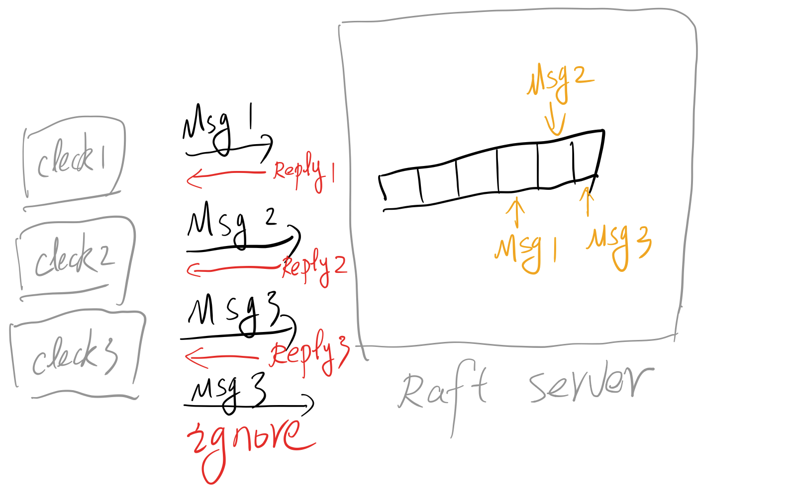

#### LAB 3A

如图一所示：Lab3A的任务主要是在Lab2实现的Raft基础上，完成Client对Raft Server集群的读写。这里面就涉及到了读写过程中的冪等性，以及多个Client的并发读写问题。

#### 1. 实现多Client并发读写问题

​	为了提高Raft集群的读写性能，我们必定是采用并发的读写模型来对集群中的log进行操作，这就导致了Raft的Leader会同时处理多个request，且这些request的执行顺序和执行时间都不可预测。那么什么时候某个读写操作已完成，以及完成的读写操作结果应该返回那个Cleck就是并发读写过程中必须面对的问题了。我们知道Raft Server每接收到一条读写操作，都会将其作为Command应用到状态机中，当一条Command Apply到状态机器中以后，才可以视为该请求中的命令被被成功应用，而不是仅仅只是复制到本地。因为每执行一条Command，都需要调用Raft中的Start函数得到Command所处log中的index：

~~~go
func (rf *Raft) Start(command interface{}) (int, int, bool) {
	// Your code here (2B).
	return index, term, isLeader
}
~~~

因为index是唯一的，我们可以此为作为标记来管理不同的请求，即为每一个index设置一个chan来完成Apply Command进程和RPC进程之间的通讯，以PutAppend为例：

1. 当Raft Leader收到了一条PutAppend请求时调用Start()将其复制到其他节点并等待提交。
2. 当位于index的Command被提交以后，通过chan 通知PutAppend进程，并且检测提交的Command和原有的Command是否相同。
3. 如果两条命令相同则可以视为该请求成，给Client返回成功，如果之前的Command被别的Command覆盖则返回失败。还有一种情况就是一直没有提交（如该raft出现网络分区无法达成共识），因此应该设置一个超时时间，当时间超过某个时间就应该直接返回失败。

~~~go
func (kv *KVServer) PutAppend(args *PutAppendArgs, reply *PutAppendReply) {
	_ , isLeader := kv.rf.GetState()
	reply.IsLeader = false;
	if !isLeader{
		return
	}
	oringalOp := Op{args.Op, args.Key,args.Value, args.Id, args.Seq}
	index, _, isLeader := kv.rf.Start(oringalOp)
	if !isLeader {
		return
	}
	ch := kv.getChan(index)
	op := kv.replyNotify(ch)
	if kv.equal(oringalOp , op){
		reply.IsLeader = true
		return
	} 
}
~~~

监测位于index的log是否apply并且NotifyRPC进程的代码在后面的StartKVServer函数中,下面给出replyNotify超时打破阻塞的实现。

~~~go
// 超时应该打破进程阻塞，避免死锁
func (kv *KVServer) replyNotify(ch chan Op) Op {
	select{
	case op := <- ch:
		return op
	case <- time.After(time.Second):
		return Op{}
	}
}
~~~

#### 2. 实现读写的幂等性

冪等性其实就是同一操作多次执行也不会改变最终结果即：*f*(*f*(*x*)) = *f*(*x*) 。因为网络的不可靠性，可能存在多条Client发送了多条相同的PutAppend给Raft Server，因此我们必须去除相同命令的重复执行所带来的的问题。 

在我看来读请求不会破坏整个系统的冪等性，因此只需要考虑写请求。在实现过程中，给每一个PutAppend Request设置一个uniqueId，并在Server端记录已经执行的Command既可以完成去重，实现冪等性。

1. 客户端使用使用id和seq共同作为uniqueId并且将这些信息发送给Raft Server：

~~~go
type Clerk struct {
	servers []*labrpc.ClientEnd
	leaderId int
    // 使用id和seq共同作为uniqueId
	id int64
	seq int64
}
// 不断发送PutAppend直到成功
func (ck *Clerk) PutAppend(key string, value string, op string) {
	args := PutAppendArgs{key,value,op, ck.id,ck.seq}
	ck.seq++
	id := ck.leaderId
	for {
		reply := PutAppendReply{}
		ok := ck.servers[id].Call("KVServer.PutAppend", &args, &reply)
		if (ok && reply.IsLeader){
			ck.leaderId = id;
			return 
		}
		id = (id + 1) % len(ck.servers)
	} 
}
~~~

2. 服务端则添加一个记录那些client的command已经执行的数据结构去除重复执行的影响。

~~~go
//初始化KVServer添加一个go routine来检测Command的Apply信息
func StartKVServer(servers []*labrpc.ClientEnd, me int,
	persister *raft.Persister, maxraftstate int) *KVServer {
	.......
    .......
    //如果有Command Apply，则这边会收到消息并且通知对应的处理Request的RPC进程
	go func ()  {
		for applyMsg := range kv.applyCh {
			op := applyMsg.Command.(Op) 
			kv.mu.Lock()
			MaxSeq, find := kv.Seq[op.Id]
			if (!find || MaxSeq < op.Seq){
				switch op.Option {
					case "Append":  kv.db[op.Key] += op.Value;
					case "Put":		kv.db[op.Key] = op.Value;
				}
				kv.Seq[op.Id] = op.Seq
			}
			kv.mu.Unlock()
			index :=  applyMsg.CommandIndex
			ch := kv.getChan(index)
			ch <- op
		}
	}()	
	return kv
}

~~~

 