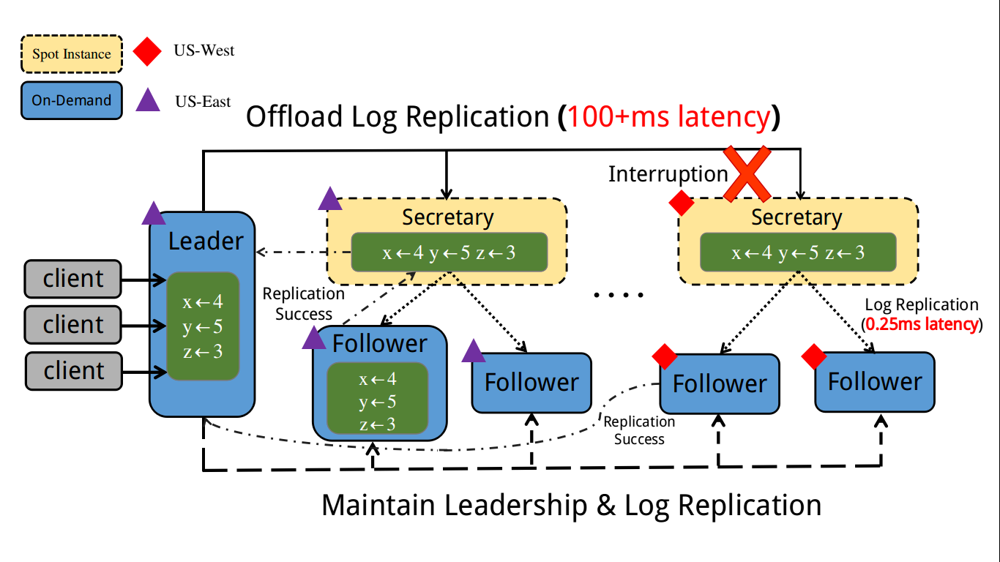
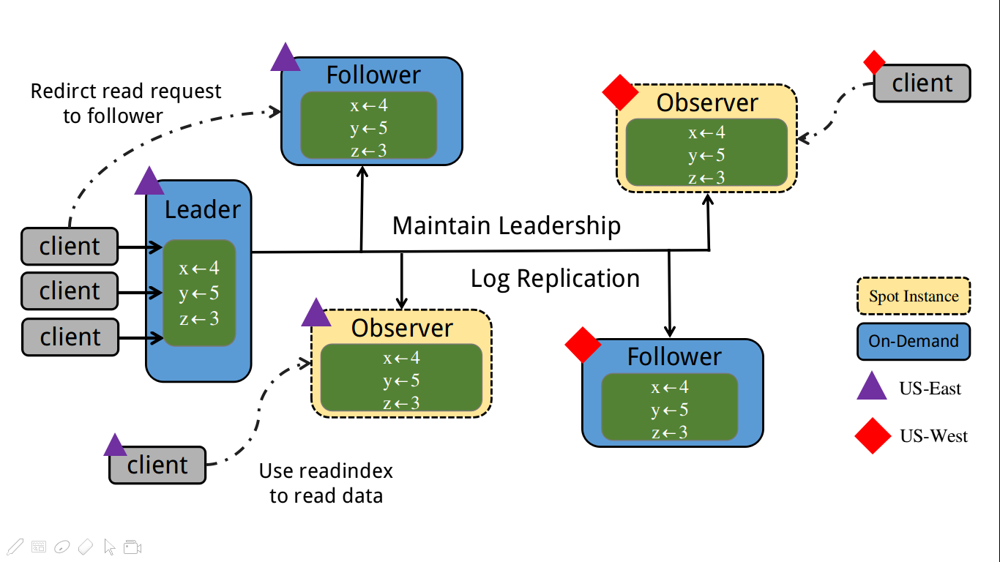

## Geo-Raft 算法

​	Geo-Raft是基于spot instance的一种raft的扩展算法，主要的想法是将secretary和observer运行在spot instance上，其中secretary和observer都是无状态的。其中observer这个角色在etcd中已经被实现成了但是我们的使用这两个角色的最初目的是如何利用不可靠的spot instance来提供可靠的一致性服务。并且由于spot instance的费用只有on demand的十分之一，所以可以极大的降低云服务的费用。

### 1.Secretary：

#### 1.1 创建

​	在Geo-Raft集群中的写压力比较大且Follower节点比较多，Leader的Log Replication会成为整个系统的一个性能瓶颈，此时：

1. Leader需要发送的数据量：LogSize = FollowerNum * LogSize
2. Leader需要处理的网络连接数：ConnectNum =  FollowerNum

​	当Leader网络带宽成为瓶颈或者CPU成为瓶颈时， **Leader创建一个快照(或指定一个 Follower)，将其发送给新引入的Secretary**，用来分担Leader的Log Replication压力此时：

1. Leader需要发送的数据量：LogSize = ResetFollowerNum  * LogSize + SecretaryNum * LogSize 
2. Leader需要处理的网络连接数：ConnectNum =  ResetFollowerNum  +  SecretaryNum

####　1.2 同步

​	引入了Secretary以后，Leader会把与该Secretary处于**同一数据中心**的Follower的Log Replication交由Secretary来负责，并维护一个SecretaryFollower的数组用以记录被Secretary接管的Follower。

 	1. 当Secretary正常的时候Leader调用L2SAppendEntries将Log同步到Secretary，再由Secretary将Log同步到Follower，并返回其管理Follower节点的Matchindex，让Leader能够Commit已经复制过半的Log。
 	2. 当Secretary Interrupted后，Leader与Secretary无法通信，此时Leader会立刻将SecretaryFollower中的Follower重新接管，并进行Log同步。

#### 1.3 一致

​	因为Secretary不参与Geo-raft中的选举过程，所以当有新的leader产生时候可能会导致Log的冲突。

1. 当新的Leader产生时可以直接引入新的Secretary，Leader创建一个快照(或指定一个 Follower)，将其发送给当前Secretary。
2. 当新的Leader产生时Secretary应该等到确认与Leader的log没有冲突时（commit一条新的指令）才能继续将Log同步到Follower。

**在正常情况下，Geo-raft中所有的Log都是由Leader流向Follower，不会产生版本的Log的冲突。**

**当系统出现Leader选举或者网络分区时，Secretary只有在系统恢复正常状态以后（解决Log冲突）才继续参与到Log的复制中来**

### 2. Observer

#### 2.1 创建

​	在Geo-Raft集群中的读压力比较大且Follower节点比较小，整个Raft的集群的IO压力会比较大。此时因为集群中的Follower数量非常少，所以即使是将一部分的读压力分担给Follower，各个节点的IO压力也会非常的大。

IO = ReadData / (LeaderNum + FollowerNum)

此时可以由 **Leader创建一个快照(或指定一个 Follower)，将其发送给新引入的Observer**来分担读压力:

IO = ReadData / (LeaderNum + FollowerNum + ObserverNum)

#### 2.2 同步

引入了Observer以后，Leader或者Secretary会将Log 同步到Observer上面，并且Observer可以处理Leader转发的Read Request。

1.  read 请求到达 leader 之后转发请求时需要获取最新的 commit index，然后再等到 applied index >= commit index 之后再 read 数据返回 

### 3. Appendix

当前定义的RPC：

~~~protobuf
syntax = "proto3";
service RAFT {
    rpc RequestVote (RequestVoteArgs) returns (RequestVoteReply) {};
    rpc AppendEntries (AppendEntriesArgs) returns (AppendEntriesReply){};
}
message RequestVoteArgs {
    int32 Term = 1;
    int32 CandidateId = 2;
    int32 LastLogIndex = 3;
    int32 LastLogTerm = 4;
}
message RequestVoteReply {
    int32 Term = 1;        
    bool VoteGranted = 2; 
}
message AppendEntriesArgs {
    int32 Term = 1;     
    int32 LeaderId = 2;  
    int32 PrevLogIndex = 3;      
    int32 PrevLogTerm = 4;      
    bytes      Log = 5;  
    int32 LeaderCommit = 6;    
}
message AppendEntriesReply{
    int32 Term = 1;             
    bool Success = 2;       
    int32 ConflictIndex  = 3;
    int32 ConflictTerm  = 4;
}
service Secretary {
    rpc L2SAppendEntries (AppendEntriesArgs) returns (L2SAppendEntriesReply) {};
}
message L2SAppendEntriesReply {
    bytes MatchIndex = 1;
}
service Observer{
    rpc AppendEntries (AppendEntriesArgs) returns (AppendEntriesReply){};
}
~~~

